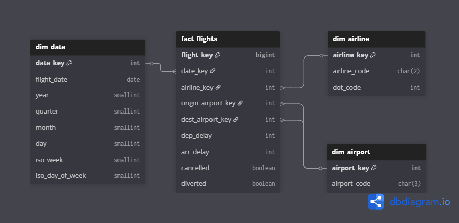

# Flight Operations — SQL Analytics Project

## Project Overview

This project analyzes **U.S. commercial flight operations** using **SQL** and a **dimensional star schema**.

The goal is to show how large-scale operational records can be transformed into a **clean, consistent analytical model** suitable for reliable KPI computation on delays and operational performance.

Key figures:

* ~**3.0 million** total flight records
* ~**2.9 million** operated flights
* **18 airlines**
* **380 airports**
* Multi-year daily coverage

The project is structured as a small **BI-oriented analytical warehouse**, with clear separation between data modeling and KPI consumption.

---

## What This Project Demonstrates

* End-to-end SQL workflow: **STAGING → ANALYSIS → MART**
* Dimensional modeling with explicit analytical grain
* Flight-level KPI design for operational analytics
* Deterministic, reproducible transformations
* Documentation aligned with analytical logic

---

## Analytical Data Model

The core of the project is a **star schema** centered on a flight-level fact table.

Model components:

* **Fact table**: one row per flight observation
* **Dimensions**:

  * Date
  * Airline
  * Airport (used for both origin and destination)

This structure enables:

* Stable joins
* Consistent aggregations
* Straightforward extension at the reporting layer

  

---

## Fact Table Grain

The analytical grain is:

**One row per flight observation**

Each row represents a single flight defined by:

* Flight date
* Airline
* Origin airport
* Destination airport

All KPIs are computed from this atomic level.
Aggregations are applied only in the MART layer.

---

## Data Coverage and Composition

After filtering and validation:

* **~79,000** cancelled flights
* **~7,000** diverted flights
* **~2.9 million** operated flights used for KPI computation

All operated flights include valid departure and arrival delay values.

---

## Main Analytical Questions

The model supports analysis such as:

* How often do delays occur?
* How large are delays when they occur?
* Which airlines and airports concentrate most of the operational impact?
* How do delay patterns evolve over time?
* How concentrated are extreme delay events?

---

## KPI Design Approach

KPIs are grouped by analytical intent:

* **Frequency**: share of delayed flights
* **Severity**: average delay in minutes
* **Impact**: expected delay per flight
* **Tail risk**: p90 / p95 delay values

Each KPI is computed on a clearly defined population and documented consistently.

---

## Valid Population Definition

A *valid flight* for KPI purposes is defined as:

* Not cancelled
* Not diverted

This rule is applied uniformly across all metrics.

---

## Volume Distribution and Stability

Flight volumes are highly skewed, especially at airport level.

**Airports (operated flights):**

* Median (p50): ~**1,000**
* p75: ~**5,000**
* p90: ~**21,000**
* Maximum: ~**151,000**

**Airlines (operated flights):**

* Median (p50): ~**106,000**
* p75: ~**221,000**
* p90: ~**376,000**

These distributions are used to define **minimum volume thresholds** for stable KPIs in the MART layer.

---

## Main KPI Result Example

The primary KPI output combines **delay frequency** and **average delay severity** to highlight operational trade-offs across entities.

  

This visualization allows quick identification of:

* High-frequency / low-severity operators
* Low-frequency / high-severity operators
* Outliers with disproportionate operational impact

---

## Temporal Analysis

Time-based reporting relies on a dedicated date dimension providing:

* Calendar alignment
* Consistent ordering
* Daily granularity

Trend analysis is limited to observed data ranges.

---

## Reproducibility

* All transformations implemented in SQL
* Deterministic logic only
* No external dependencies

Running the same scripts on the same inputs always produces identical outputs.

---

## SQL as Source of Truth

SQL definitions in the repository represent:

* The authoritative data model
* The official KPI logic

Documentation explains intent and semantics without duplicating implementation.

---

## Repository Structure

* **STAGING** — cleaned source-level tables
* **ANALYSIS** — dimensional model (star schema)
* **MART** — KPI views and consumption queries
* **DOCS** — technical and analytical documentation

---

## Tools and Environment

* SQL (ANSI-style)
* Relational database with support for:

  * Window functions
  * Analytical aggregations

No proprietary extensions are required.

---

## Known Limitations

* Delay severity is expressed in minutes without normalization
* Dimensions are non-historized
* No causal attribution of delays

---

## Out of Scope

* Prediction or forecasting
* Root-cause analysis
* Real-time or streaming use cases
* External enrichment data

---

## Portfolio Relevance

This project demonstrates practical skills in:

* Dimensional modeling
* Analytical SQL
* KPI design and validation
* Data quality checks
* Structured technical documentation

---

## Notes

The dataset is based on publicly available U.S. DOT on-time performance data (via Kaggle).
Raw data is not redistributed due to licensing considerations.
The repository contains schemas, SQL logic, and aggregated analytical outputs only.
