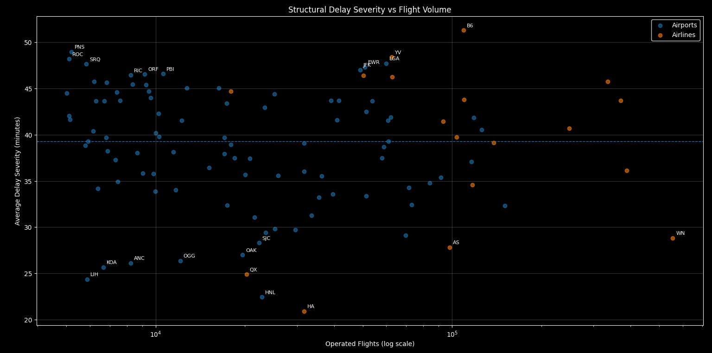

# MART Layer — KPI Framework, Definitions and Interpretation (Final, Frozen)

This document consolidates and supersedes all previous KPI-related documentation.  
It integrates:
- MART layer technical design
- KPI semantic framework
- Statistical stability rules
- Result interpretation grounded **exclusively** in observed outputs

All conclusions are constrained by the SQL results shown alongside queries.  
No new metrics, assumptions, or interpretations are introduced.

---

## 1. Role of the MART Layer

The MART layer is the **final analytical contract** of the project.

Its role is to:
- Define KPIs once, canonically
- Enforce KPI scope and eligibility
- Separate computation from consumption
- Guarantee deterministic, reproducible outputs

The layer is **frozen**.  
All downstream work is limited to consumption views, rankings, and visualization.

---

## 2. Reference Population and KPI Scope

### Valid Flight Population

All KPIs are computed on **valid flights only**, defined as flights that are:
- not cancelled
- not diverted

This population is enforced through a shared base view:

`mart.fact_flights_valid`

Cancelled and diverted flights are retained upstream for auditability but are **out of KPI scope**.

Metrics derived from different populations are not comparable.

---

## 3. Canonical KPI Source

### `mart.kpi_delay_canonical`

This view is the **single source of truth** for all KPIs.

Design properties:
- long format
- entity-agnostic (airport, airline)
- volume-aware
- self-sufficient
- no joins required downstream

Schema:
- `entity_type`
- `entity_code`
- `year` (NULL for structural KPIs)
- `kpi_family`
- `kpi_name`
- `kpi_value`
- `operated_flights` (eligibility gatekeeper)

The MART layer **computes everything**.  
Validity is enforced only at consumption time.

---

## 4. KPI Design Framework

### Design Principles

All KPIs follow shared semantic rules:
- explicit population
- explicit grain
- explicit thresholds
- single definition, reused verbatim

Thresholds are **reporting safeguards**, not data corrections.  
Underlying data is never altered.

---

## 5. KPI Families and Semantic Separation

KPIs describe **orthogonal dimensions** of performance and must not be conflated.

| Family     | What it measures                    |
|-----------|--------------------------------------|
| Frequency | How often delays occur               |
| Severity  | How long delays last when they occur |
| Impact    | Operational prioritization proxy     |
| Tail risk | Exposure to extreme delays           |

Joint interpretation is mandatory.

---

## 6. KPI Definitions and Results (Closed Set)

---

### KPI 1 — Delay Frequency (Temporal)

**Definition**
- Name: `delayed_flights_pct`
- Metric: % of flights with `arr_delay > 0`
- Grain: entity × year
- Population: all valid flights
- Temporal KPI (only KPI computed year-over-year)

This KPI measures **how often** disruption occurs, not its magnitude.

**System-level baseline (airports)**

| Year | Avg delay frequency (%) |
|:---:|:------------------------:|
| 2019 | 32.70 |
| 2020 | 20.92 |
| 2021 | 31.85 |
| 2022 | 36.39 |
| 2023 | 38.47 |

Constrained interpretation:
- 2020 reflects an exogenous shock
- Post-2021 trend is monotonically increasing
- 2023 is worse than 2019

**System conclusion**

> Post-COVID flight operations have not returned to pre-COVID reliability.  
> Delay frequency is structurally higher.

---

### KPI 2 — Delay Severity (Conditional, Structural)

**Definition**
- Name: `avg_delay_severity_[min]`
- Metric: average arrival delay, late flights only
- Grain: entity (cross-year)
- Structural KPI

This KPI measures **how bad delays are when they happen**.  
It is not comparable to frequency.

**Top severity observations (illustrative)**

| entity_type | entity_code | avg_delay_severity (min) | operated_flights |
|------------|-------------|---------------------------|------------------|
| airline | B6 | 51.30 | 109,447 |
| airport | PNS | 48.98 | 5,194 |
| airline | YV | 48.41 | 62,477 |
| airport | ROC | 48.21 | 5,106 |
| airport | LGA | 47.73 | 59,923 |

Key observation:
> Severity varies widely across entities and is not proportional to delay frequency.

---

### KPI 3 — Severity Distribution (Structural)

This KPI is interpreted visually to assess **severity vs traffic volume**.

  

Observed pattern:
- High-volume entities can exhibit both low and very high severity
- Severity is not explained by volume alone

Conclusion:
> Delay severity is a structural property, not a scale effect.

---

### KPI 4 — Frequency vs Severity (Combined Reading)

This KPI combines **delay frequency** and **delay severity** to identify behavioral clusters.

  

Observed clusters:
- high frequency / low severity
- moderate frequency / high severity
- entities with disproportionate damage per delay

Conclusion:
> Who delays often is not necessarily who causes the most damage.

This KPI establishes the **behavioral clusters** used in subsequent analysis.

---

### KPI 5 — Expected Delay Impact (Structural)

**Definition**
- Name: `expected_delay_impact_[min/100_flights]`
- Metric: expected delay minutes per 100 flights
- Formula: `delay_frequency × avg_delay_severity`
- Grain: entity (cross-year)

Purpose:
> Operational prioritization, not explanation.

**Top impact ranking (excerpt)**

| Entity | Impact (min / 100 flights) | Operated flights |
|-------|----------------------------|------------------|
| B6 | 2,090 | 109,447 |
| G4 | 2,030 | 50,179 |
| F9 | 1,910 | 62,712 |
| EWR | 1,810 | 50,808 |
| SJU | 1,750 | 12,721 |

Interpretation:
> This KPI identifies where intervention yields the highest potential benefit,  
> independent of causal attribution.

---

### KPI 6 — Tail Risk (Structural, Validated)

**Definition**
- Names:
  - `p90_delay_[min]`
  - `p95_delay_[min]`
- Metric: high percentiles of arrival delay, late flights only
- Grain: entity (cross-year)
- Structural KPI

This KPI captures **exposure to extreme delays**, not central tendency.

#### Global p95 Distribution (Eligibility ≥ 20k flights)

| entity_type | p50_p95 | p75_p95 | p90_p95 |
|------------|---------|---------|---------|
| airline | 150 | 160 | 174 |
| airport | 130 | 150 | 161 |

**Formal interpretation scale**

- p95 ≤ p50 → high structural resilience  
- p50 < p95 ≤ p75 → intermediate resilience  
- p95 > p75 → structural fragility  
- p95 ≥ p90 → extreme fragility  

---

#### Selected Airport Comparison (Validated)

| Airport | p95 (min) | Position vs distribution |
|--------|-----------|--------------------------|
| HNL | 80 | ≪ p50 |
| DAL | 100 | ≪ p50 |
| SEA | 100 | ≪ p50 |
| SAN | 120 | < p50 |
| JFK | 170 | > p90 |
| EWR | 170 | > p90 |
| LGA | 170 | > p90 |

Conclusion:
> Airports differ sharply in extreme-delay exposure.  
> Tail behavior is a stable structural property.

---

#### Selected Airline Comparison (Validated)

| Airline | p95 (min) | Position vs distribution |
|--------|-----------|--------------------------|
| HA | 60 | ≪ p50 |
| AS | 100 | ≪ p50 |
| WN | 100 | ≪ p50 |
| QX | 100 | ≪ p50 |
| OO | 170 | ≈ p90 |
| G4 | 170 | ≈ p90 |
| B6 | 180 | > p90 |
| YV | 180 | > p90 |

Conclusion:
> Heavy tails are not noise.  
> Some airlines are structurally exposed to extreme delays even when frequency is moderate.

---

## 7. Statistical Stability and Eligibility Rules

### Principle

Below threshold, a KPI is **undefined**, not low.

Every consumption view must expose:
- `operated_flights`

---

### Observed Airport Volume Distribution

| Statistic | Operated flights |
|----------|------------------|
| Total airports | ~380 |
| p50 | ~1,000 |
| p75 | ~5,000 |
| p90 | ~21,000 |
| Max | ~151,000 |

Distribution is strongly right-skewed.

---

### Cutoff by KPI Family

| KPI family | Minimum flights |
|-----------|-----------------|
| frequency | ≥ 1,000 |
| severity  | ≥ 5,000 |
| impact    | ≥ 5,000 |
| tail_risk | ≥ 20,000 |

Below cutoff:
- KPIs are not exposed
- no warnings
- no imputation

---

## 8. Implementation Rules

- MART canonical views do not filter
- Thresholds live in the consumption layer
- No KPI shown below eligibility
- Deterministic ordering and ranking only

Repeated executions yield identical outputs.

---

## 9. Known Limitations

- Severity is a proxy, not a full normalization
- Cancelled and diverted flights are excluded by design
- No causal attribution is modeled

These constraints are intentional.
